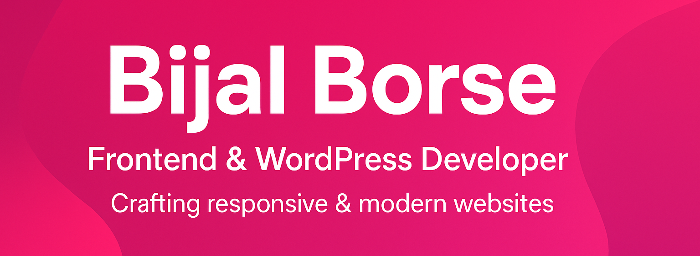

<!-- Banner -->

  

# Hi, I'm Bijal Borse 👋  

💼 **Frontend & WordPress Developer | 3+ Years of Experience**  
🌍 Based in Ahmedabad, India | 🚀 Open to exciting opportunities  

I specialize in crafting **modern, responsive, and user-friendly websites** with a strong focus on **WordPress development**.  
From **custom HTML/CSS projects** to advanced **WordPress ACF implementations**, and drag-and-drop builders like **Elementor, Divi, and WPBakery** – I bring ideas to life with precision and creativity.  

---

## 🛠️ Tech Stack & Skills  
✅ **WordPress Development** – Custom Themes, ACF, Plugins, Builders (Elementor, Divi, WPBakery)  
✅ **Frontend Development** – HTML5, CSS3, JavaScript (Basics), Bootstrap, Tailwind CSS  
✅ **Website Optimization** – Speed, SEO Basics, Cross-Browser Compatibility  
✅ **Other Tools** – Git/GitHub, Figma (basic UI collaboration), Photoshop (basic edits)  

---

## 📌 Featured Work  
🌐 **Portfolio:** [bijal-borse.github.io/portfolio](https://bijal-borse.github.io/portfolio)  
📄 **Resume:** Included in my portfolio website  

---

## 📊 GitHub Highlights  

  
  

  

  

  

---

## 🤝 Let's Connect  
  
  
  

---

 
   

⭐️ _“Great websites aren’t just built — they’re designed with purpose.”_
